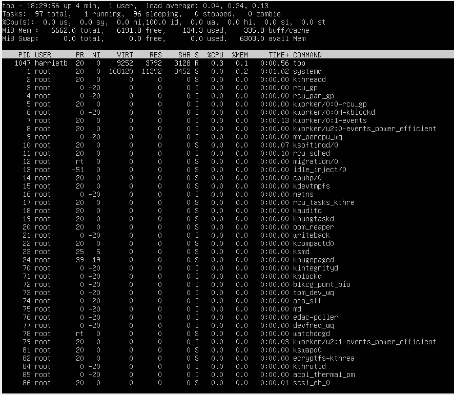
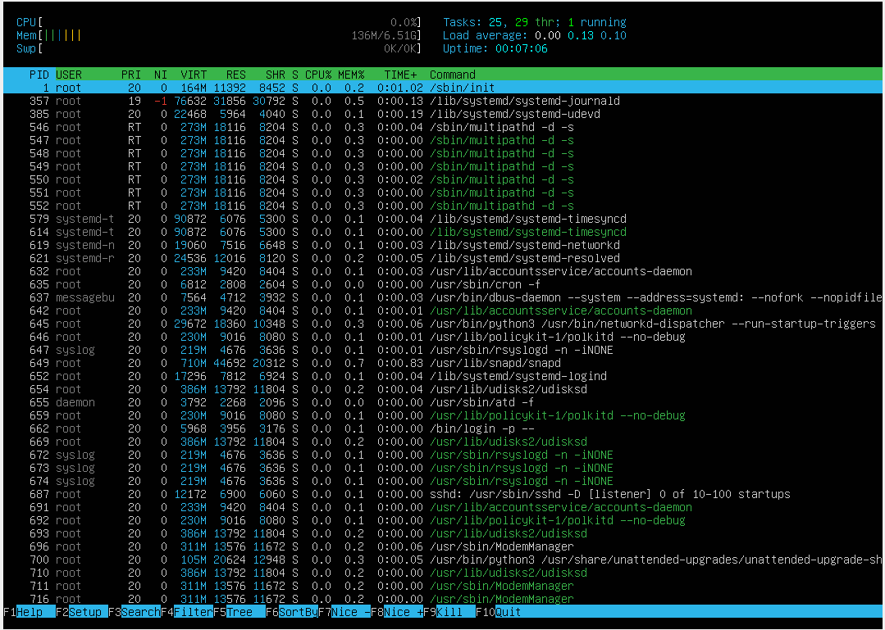

## Part 1. Установка ОС

- Узнайте версию Ubuntu, выполнив команду \
`cat /etc/issue.`\

## Part 2. Создание пользователя
- Вставьте скриншот вызова команды для создания пользователя.\

- Новый пользователь должен быть в выводе команды \
`cat /etc/passwd`\

## Part 3. Настройка сети ОС
##### Задать название машины вида user-1

##### Установить временную зону, соответствующую вашему текущему местоположению.

##### Вывести названия сетевых интерфейсов с помощью консольной команды.
- В отчёте дать объяснение наличию интерфейса lo.\

>lo (loopback device) – виртуальный интерфейс, присутствующий по умолчанию в любом Linux. 
>Он используется для отладки сетевых программ и запуска серверных приложений на локальной машине
##### Используя консольную команду получить ip адрес устройства, на котором вы работаете, от DHCP сервера. 
- В отчёте дать расшифровку DHCP.  

>DHCP (Dynamic Host Configuration Protocol — протокол динамической настройки узла) — прикладной протокол, 
>позволяющий сетевым устройствам автоматически получать IP-адрес и другие параметры, необходимые для работы в сети TCP/IP.
##### Определить и вывести на экран внешний ip-адрес шлюза (ip) и внутренний IP-адрес шлюза, он же ip-адрес по умолчанию (gw). 

##### Задать статичные (заданные вручную, а не полученные от DHCP сервера) настройки ip, gw, dns (использовать публичный DNS серверы, например 1.1.1.1 или 8.8.8.8).  

##### Перезагрузить виртуальную машину. Убедиться, что статичные сетевые настройки (ip, gw, dns) соответствуют заданным в предыдущем пункте.

##### Успешно пропинговать удаленные хосты 1.1.1.1 и ya.ru и вставить в отчёт скрин с выводом команды. В выводе команды должна быть фраза "0% packet loss".

## Part 4. Обновление ОС
##### Обновить системные пакеты до последней на момент выполнения задания версии.  
- После обновления системных пакетов, если ввести команду обновления повторно, должно появится сообщение, что обновления отсутствуют.
- Вставить скриншот с этим сообщением в отчёт.\

## Part 5. Использование команды **sudo**
Разрешить пользователю, созданному в Part 2, выполнять команду sudo.
- В отчёте объяснить *истинное* назначение команды sudo (про то, что это слово - "волшебное", писать не стоит).  
- Поменять hostname ОС от имени пользователя, созданного в пункте [Part 2](#part-2-создание-пользователя) (используя sudo).
- Вставить скрин с изменённым hostname в отчёт.\

>Команда sudo предоставляет возможность пользователям выполнять команды от имени суперпользователя(root).
## Part 6. Установка и настройка службы времени
- Вывести время, часового пояса, в котором вы сейчас находитесь.\

## Part 7. Установка и использование текстовых редакторов 
##### Установить текстовые редакторы **VIM** (+ любые два по желанию **NANO**, **MCEDIT**, **JOE** и т.д.)  
- Выход с сохранением
  - VIM. Команды: ESC, :wq, enter\

  - Nano. Команды: ctrl+x, y, enter\

  - Mcedit. Команды: F10, y\

- Выход без сохранения
  - VIM. Команды: ESC, :q!, enter\

  - Nano. Команды: ctrl+x, n\

  - Mcedit. Команды: F10, n\

- Поиск и замена
  - VIM. Команды: ESC, :s/School/harrietb, enter\

  - Nano. Команды: ctrl+\, School, enter, harrietb, enter, y\

  - Mcedit. Команды: F4, School, harrietb, O, R\

## Part 8. Установка и базовая настройка сервиса **SSHD**
##### Установить службу SSHd. 
##### Добавить автостарт службы при загрузке системы. 

##### Перенастроить службу SSHd на порт 2022.  

##### Используя команду ps, показать наличие процесса sshd. Для этого к команде нужно подобрать ключи.
- В отчёте объяснить значение команды и каждого ключа в ней.

>Ключ f показывает расширенную информацию о процессе. \
>Ключ a выбирает все процеллы кроме фоновых. \
>Ключ x все процессы, которые относятся именно к вашей учетной записи. \
>Ключ v выводит дополнительные столбцы TIME STAT. 
- Вывод команды netstat -tan \

>Ключ a показывает состояние всех сокетов. \
>Ключ n показывает сетевые адреса как числа. \
>Ключ t показывает только tcp порты. \
>Proto: протокол, используемый сокетом. \
>Recv-Q: количество байтов, не скопированных пользовательской программой, подключенной к этому сокету. \
>Send-Q: количество неподтвержденных байтов удаленного хоста. \
>Local Address: локальный адрес (имя локального хоста) и номер порта сокета. \
>Foreign Address: удаленный адрес (имя удаленного хоста) и номер порта сокета. \
>State: состояние сокета. \
>0.0.0.0 означает, что подключение может быть выполнено на любой адрес. \
## Part 9. Установка и использование утилит **top**, **htop**
  - uptime 4min
  - количество авторизованных пользователей 1 user
  - общую загрузку системы 0.04, 0.24, 0.13
  - общее количество процессов 97
  - загрузку cpu 0%
  - загрузку памяти 134.3
  - pid процесса занимающего больше всего памяти PID 1
  - pid процесса, занимающего больше всего процессорного времени PID 1047 \

- вывод команды htop отсортированному по PID, PERCENT_CPU, PERCENT_MEM, TIME: \

- отфильтрованному для процесса sshd \

- с процессом syslog, найденным, используя поиск \

- с добавленным выводом hostname, clock и uptime \

## Part 10. Использование утилиты **fdisk** \

>название жесткого диска /dev/sda \
>размер 11.4Gb \
>количество секторов 23151664 \
>размер swap 0 \
## Part 11. Использование утилиты **df** \
##### Запустить команду df. \

  - размер раздела 9.48Gb
  - размер занятого пространства 2.4Gb
  - размер свободного пространства 6.56Gb
  - процент использования 27%
  - Единица измерения в выводе.  КБ
##### Запустить команду df -Th. \
 .\
    - размер раздела 9.1Gb \
    - размер занятого пространства 2.4Gb \
    - размер свободного пространства 6.3Gb \
    - процент использования 27% \
    - Тип файловой системы для раздела ext4 \
## Part 12. Использование утилиты **du** \
##### Вывести размер папок /home, /var, /var/log (в байтах, в человекочитаемом виде) \
##### Вывести размер всего содержимого в /var/log (не общее, а каждого вложенного элемента, используя *) \

## Part 13. Установка и использование утилиты **ncdu** \
##### Вывести размер папок /home, /var, /var/log. \
- /home \

- /var \

- /var/log \

## Part 14. Работа с системными журналами \
##### 1. /var/log/dmesg \

##### 2. /var/log/syslog \

##### 3. /var/log/auth.log \

- время последней успешной авторизации, имя пользователя и метод входа в систему. \
>время 20:01:38, harrietb, su:session \
- Перезапустить службу SSHd. \

- Вставить в отчёт скрин с сообщением о рестарте службы (искать в логах). \

## Part 15. Использование планировщика заданий **CRON**
##### Используя планировщик заданий, запустите команду uptime через каждые 2 минуты.
- Найти в системных журналах строчки (минимум две в заданном временном диапазоне) о выполнении. \

- Вывести на экран список текущих заданий для CRON. \

##### Удалите все задания из планировщика заданий.
- В отчёт вставьте скрин со списком текущих заданий для CRON. \

