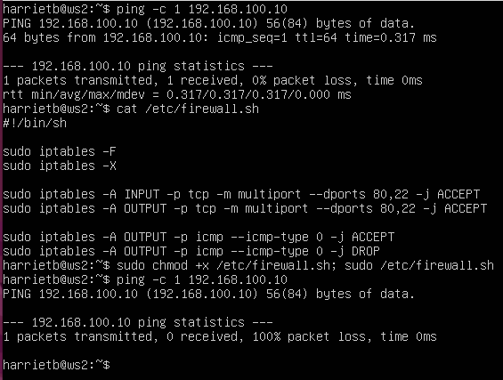
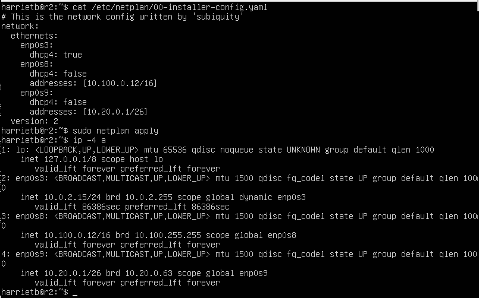
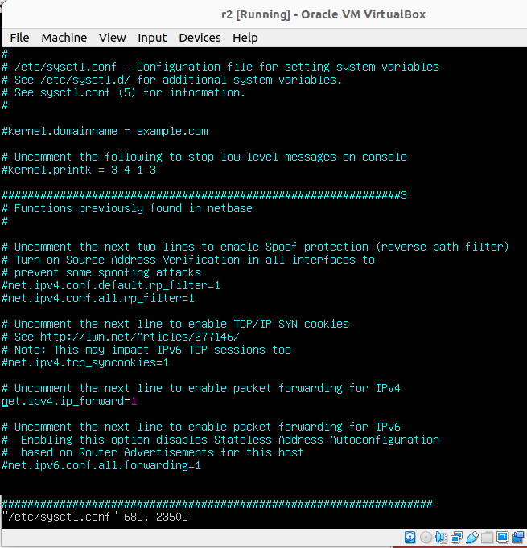
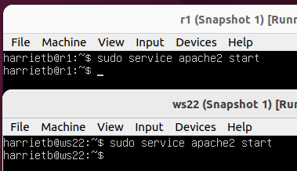
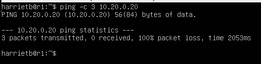

## Part 1. Инструмент **ipcalc**
#### 1.1. Сети и маски
##### Определить и записать в отчёт:
##### 1) Адрес сети *192.167.38.54/13*

> адрес сети Network:   192.160.0.0/13       11000000.10100 000.00000000.00000000

##### 2) Перевод маски *255.255.255.0* в префиксную и двоичную запись, */15* в обычную и двоичную, *11111111.11111111.11111111.11110000* в обычную и префиксную

> перфиксная запись: /24
> двоичная запись: 11111111.11111111.11111111.00000000


> обычная запись: 255.254.0.0
> двоичная запись: 11111111.11111110.00000000.00000000

> 11111111.11111111.11111111.11110000
> обычная запись: 255.255.225.240 
> перфиксная запись: /28

##### 3) Минимальный и максимальный хост в сети *12.167.38.4* при масках: */8*, *11111111.11111111.00000000.00000000*, *255.255.254.0* и */4*


> 12.167.38.4/8
> Минимальный хост: 12.0.0.1
> Максимальный хост: 12.255.255.254


> 12.167.38.4/11111111.11111111.00000000.00000000
> Минимальный хост: 12.167.0.1
> Максимальный хост: 12.167.255.254


> 12.167.38.4/255.255.254.0
> Минимальный хост: 12.167.38.1
> Максимальный хост: 12.167.39.254


> 12.167.38.4/4
> Минимальный хост: 0.0.0.1
> Максимальный хост: 15.255.255.254

#### 1.2. localhost
##### Определить и записать в отчёт, можно ли обратиться к приложению, работающему на localhost, со следующими IP: *194.34.23.100*, *127.0.0.2*, *127.1.0.1*, *128.0.0.1*

<br/>

> 194.34.23.100 - *нельзя*
> 127.0.0.2 - *можно*
> 127.1.0.1 - *можно*
> 128.0.0.1 - *нельзя*

#### 1.3. Диапазоны и сегменты сетей
##### Определить и записать в отчёт:
##### 1) какие из перечисленных IP можно использовать в качестве публичного, а какие только в качестве частных: *10.0.0.45*, *134.43.0.2*, *192.168.4.2*, *172.20.250.4*, *172.0.2.1*, *192.172.0.1*, *172.68.0.2*, *172.16.255.255*, *10.10.10.10*, *192.169.168.1*
<br/>
<br/>
<br/>


> *10.0.0.45*, private
> *134.43.0.2*, public
> *192.168.4.2*, private
> *172.20.250.4*, private
> *172.0.2.1*, public
> *192.172.0.1*, public
> *172.68.0.2*, public
> *172.16.255.255*, private
> *10.10.10.10*, private
> *192.169.168.1*, public

##### 2) какие из перечисленных IP адресов шлюза возможны у сети *10.10.0.0/18*: *10.0.0.1*, *10.10.0.2*, *10.10.10.10*, *10.10.100.1*, *10.10.1.255*

> *10.0.0.1*, нет
> *10.10.0.2*, да
> *10.10.10.10*, да
> *10.10.100.1*, нет
> *10.10.1.255*, да

## Part 2. Статическая маршрутизация между двумя машинами
##### Поднять две виртуальные машины (далее -- ws1 и ws2)

##### С помощью команды `ip a` посмотреть существующие сетевые интерфейсы

##### Описать сетевой интерфейс, соответствующий внутренней сети, на обеих машинах и задать следующие адреса и маски: ws1 - *192.168.100.10*, маска */16*, ws2 - *172.24.116.8*, маска */12*
- В отчёт поместить скрины с содержанием изменённого файла *etc/netplan/00-installer-config.yaml* для каждой машины.
##### Выполнить команду `netplan apply` для перезапуска сервиса сети


#### 2.1. Добавление статического маршрута вручную
##### Добавить статический маршрут от одной машины до другой и обратно при помощи команды вида `ip r add`
##### Пропинговать соединение между машинами
- В отчёт поместить скрин с вызовом и выводом использованных команд.<br/>
<br/>


#### 2.2. Добавление статического маршрута с сохранением
##### Перезапустить машины
##### Добавить статический маршрут от одной машины до другой с помощью файла *etc/netplan/00-installer-config.yaml*
- В отчёт поместить скрин с содержанием изменённого файла *etc/netplan/00-installer-config.yaml*.
##### Пропинговать соединение между машинами
- В отчёт поместить скрин с вызовом и выводом использованной команды.<br/>
<br/>


## Part 3. Утилита **iperf3**
#### 3.1. Скорость соединения
##### Перевести и записать в отчёт: 8 Mbps в MB/s, 100 MB/s в Kbps, 1 Gbps в Mbps
> 8 Mbps = 1 MB/s,
> 100 MB/s = 819200 Kbps, 
> 1 Gbps = 1024 Mbps

#### 3.2. Утилита **iperf3**
##### Измерить скорость соединения между ws1 и ws2
- В отчёт поместить скрины с вызовом и выводом использованных команд.
> ws1 - сервер, ws2 - клиент


> скорость 3.17 Gbps на отправку и прием

## Part 4. Сетевой экран
#### 4.1. Утилита **iptables**
##### Создать файл */etc/firewall.sh*, имитирующий фаерволл, на ws1 и ws2:
##### 1) на ws1 применить стратегию когда в начале пишется запрещающее правило, а в конце пишется разрешающее правило (это касается пунктов 4 и 5)
##### 2) на ws2 применить стратегию когда в начале пишется разрешающее правило, а в конце пишется запрещающее правило (это касается пунктов 4 и 5)
##### 3) открыть на машинах доступ для порта 22 (ssh) и порта 80 (http)
##### 4) запретить *echo reply* (машина не должна "пинговаться”, т.е. должна быть блокировка на OUTPUT)
##### 5) разрешить *echo reply* (машина должна "пинговаться")
- В отчёт поместить скрины с содержанием файла */etc/firewall* для каждой машины.
##### Запустить файлы на обеих машинах командами `chmod +x /etc/firewall.sh` и `/etc/firewall.sh`
<br/>

```shell
ws1 может пинговать ws2, а ws2 не может пинговать ws1
У ws1 первым идет запрещающее правило, а вторым разрешающее, поэтому пинг не проходит на ws1
У ws2 наоборот, первым идет разрешающее правило, а вторым запрещающее, поэтому пинг на ws2 проходит.
```

#### 4.2. Утилита **nmap**
##### Командой **ping** найти машину, которая не "пингуется", после чего утилитой **nmap** показать, что хост машины запущен


## Part 5. Статическая маршрутизация сети
##### Поднять пять виртуальных машин (3 рабочие станции (ws11, ws21, ws22) и 2 роутера (r1, r2))
##### Настроить конфигурации машин в *etc/netplan/00-installer-config.yaml* согласно сети на рисунке.
##### Перезапустить сервис сети. Если ошибок нет, то командой `ip -4 a` проверить, что адрес машины задан верно. Также пропинговать ws22 с ws21. Аналогично пропинговать r1 с ws11.



#### 5.2. Включение переадресации IP-адресов.
##### Для включения переадресации IP, выполните команду на роутерах:
`sysctl -w net.ipv4.ip_forward=1`<br/>

##### Откройте файл */etc/sysctl.conf* и добавьте в него следующую строку:
`net.ipv4.ip_forward = 1`<br/>



#### 5.3. Установка маршрута по-умолчанию
##### Настроить маршрут по-умолчанию (шлюз) для рабочих станций. Для этого добавить `default` перед IP роутера в файле конфигураций
##### Вызвать `ip r` и показать, что добавился маршрут в таблицу маршрутизации

<br/>
<br/>


##### Пропинговать с ws11 роутер r2 и показать на r2, что пинг доходит. Для этого использовать команду:
`tcpdump -tn -i eth1`

<br/>


#### 5.4. Добавление статических маршрутов
##### Добавить в роутеры r1 и r2 статические маршруты в файле конфигураций.
##### Вызвать `ip r` и показать таблицы с маршрутами на обоих роутерах.

<br/>


##### Запустить команды на ws11:
`ip r list 10.10.0.0/[маска сети]` и `ip r list 0.0.0.0/0`


- В первом случае есть сеть 10.10.0.0/18 на которую через enp0s8 подается трафик, `proto kernel` значит, что правило роутинга было задано ядром автоматически при задании IP интерфейса. `scope link src 10.10.0.2` значит, что правило работает только для enp0s8 и отправителя пакетов с IP 10.10.0.2. 10.10.0.2 и 10.10.0.0 находятся в одной сети.


- Весь трафик через другие хосты идет уже по правилу, которое мы прописывали в *etc/netplan/00-installer-config.yaml*, а именно, через 10.10.0.1

#### 5.5. Построение списка маршрутизаторов
##### Запустить на r1 команду дампа:
`tcpdump -tnv -i eth0`
##### При помощи утилиты **traceroute** построить список маршрутизаторов на пути от ws11 до ws21

<br/>


traceroute постоянно отправляет пакеты с каждым шагом увеличивая время жизни этих пакетов(ttl time to live), чтобы от каждого шлюза на пути к хосту, получить ответ ICMP TIME_EXCEEDED. Таким образом станет составляя карту всех шлюзов.
```shell
traceroute отправляет целевому узлу серию ICMP-пакетов (по умолчанию 3 пакета), с каждым шагом увеличивая значение поля TTL («время жизни») на 1. 
Это поле обычно указывает максимальное количество маршрутизаторов, которое может быть пройдено пакетом.
Первая серия пакетов отправляется с TTL, равным 1, и поэтому первый же маршрутизатор возвращает обратно ICMP-сообщение «time exceeded in transit», 
указывающее на невозможность доставки данных. 
Traceroute фиксирует адрес маршрутизатора, а также время между отправкой пакета и получением ответа (эти сведения выводятся на монитор компьютера). 
Затем traceroute повторяет отправку серии пакетов, но уже с TTL, равным 2, 
что заставляет первый маршрутизатор уменьшить TTL пакетов на единицу и направить их ко второму маршрутизатору. 
Второй маршрутизатор, получив пакеты с TTL=1, так же возвращает «time exceeded in transit».
Процесс повторяется до тех пор, пока пакет не достигнет целевого узла. 
При получении ответа от этого узла процесс трассировки считается завершённым.
```

#### 5.6. Использование протокола **ICMP** при маршрутизации
##### Запустить на r1 перехват сетевого трафика, проходящего через eth0 с помощью команды:
`tcpdump -n -i eth0 icmp`
##### Пропинговать с ws11 несуществующий IP (например, *10.30.0.111*) с помощью команды:
`ping -c 1 10.30.0.111`<br/>
<br/>

> Запросы идут, а ответа нет.

## Part 6. Динамическая настройка IP с помощью **DHCP**

##### Для r2 настроить в файле */etc/dhcp/dhcpd.conf* конфигурацию службы **DHCP**:
> Сначала установим dhcp: sudo apt install isc-dhcp-server
> Отредактируем файл dhcpd.conf в соответствии с заданием 


##### В файле *resolv.conf* прописать `nameserver 8.8.8.8.`
##### Перезагрузить службу **DHCP** командой `systemctl restart isc-dhcp-server`. 


##### Машину ws21 перезагрузить при помощи `reboot` и через `ip a` показать, что она получила адрес. Также пропинговать ws22 с ws21.

>Включаем dhcp на ws21


>`ip a` выводит строчку inet 10.20.0.2/26 brd 10.20.0.63 scope global **dynamic** enp0s8


> `ping` c ws21 на ws 22 и обратно проходит успешно


##### Указать MAC адрес у ws11, для этого в *etc/netplan/00-installer-config.yaml* надо добавить строки: `macaddress: 10:10:10:10:10:BA`, `dhcp4: true`


##### Для r1 настроить аналогично r2, но сделать выдачу адресов с жесткой привязкой к MAC-адресу (ws11). Провести аналогичные тесты

> Отредактируем файл dhcpd.conf в соответствии с заданием 


> Отредактируем *resolv.conf* и перезагрузим **DHCP**


> Проверим ip a до и после установки dhcp:


> пропингуем машины с ws11 до r1 и r2

<br/>


> В **DHCP** использовались статическая маршрутизация, дефолтный шлюз, nameserver DNS

## Part 7. **NAT**

##### В файле */etc/apache2/ports.conf* на ws22 и r1 изменить строку `Listen 80` на `Listen 0.0.0.0:80`, то есть сделать сервер Apache2 общедоступным


##### Запустить веб-сервер Apache командой `service apache2 start` на ws22 и r1



##### Добавить в фаервол, созданный по аналогии с фаерволом из Части 4, на r2 следующие правила:
##### 1) Удаление правил в таблице filter - `iptables -F`
##### 2) Удаление правил в таблице "NAT" - `iptables -F -t nat`
##### 3) Отбрасывать все маршрутизируемые пакеты - `iptables --policy FORWARD DROP`


##### Проверить соединение между ws22 и r1 командой `ping`
*При запуске файла с этими правилами, ws22 не должна "пинговаться" с r1*



##### Добавить в файл ещё одно правило:
##### 4) Разрешить маршрутизацию всех пакетов протокола **ICMP**


##### Проверить соединение между ws22 и r1 командой `ping`
*При запуске файла с этими правилами, ws22 должна "пинговаться" с r1*


##### 5) Включить **SNAT**, а именно маскирование всех локальных ip из локальной сети, находящейся за r2 (по обозначениям из Части 5 - сеть 10.20.0.0)

> SNAT — трансляция внутреннего приватного адреса/адресов в публичный для доступа из сети тенанта в интернет. Все VM могут выходить в интернет через один публичный адрес, который назначается тенанту автоматически.
> DNAT — механизм, изменяющий адрес назначения пакета, а также порт назначения. Используется для перенаправления входящих пакетов с внешнего адреса/порта на приватный IP-адрес/порт внутри частной сети.


> адрес отправителя поменялся на 10.100.0.12

##### 6) Включить **DNAT** на 8080 порт машины r2 и добавить к веб-серверу Apache, запущенному на ws22, доступ извне сети

<br/>
<br/>


> При обращении к r2 порту 8080 перенаправляет на сервер Apache ws22

## Part 8. Дополнительно. Знакомство с **SSH Tunnels**

##### Запустить на r2 фаервол с правилами из Части 7
##### Запустить веб-сервер **Apache** на ws22 только на localhost (то есть в файле */etc/apache2/ports.conf* изменить строку `Listen 80` на `Listen localhost:80`)


##### Воспользоваться *Local TCP forwarding* с ws21 до ws22, чтобы получить доступ к веб-серверу на ws22 с ws21


##### Воспользоваться *Remote TCP forwarding* c ws11 до ws22, чтобы получить доступ к веб-серверу на ws22 с ws11

<br/>

